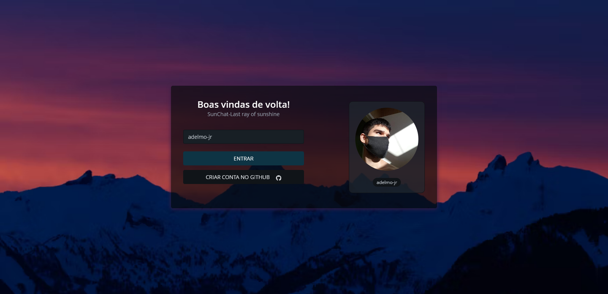
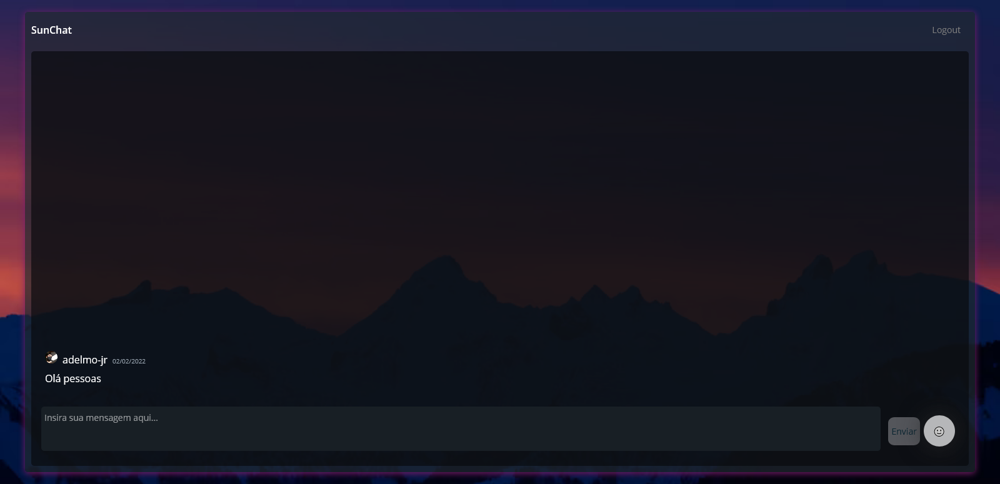

# Aluracord SunChat

# 
Projeto criado na Imersão React com a @Alura @omariosouto @peas

Teste o projeto:
https://aluracord-sunchat.vercel.app/

<h1 align="center"> 
Tela Inicial

    
</h1>

<h1 align="center"> 
Tela do Chat

    
</h1>

## 🛠💻 Tecnologias

As seguintes ferramentas foram usadas na construção do projeto:

 

- [Vercel](https://vercel.com/)
- [Supabase](https://supabase.com/)

# 🧑‍💻Autor:

- Git: https://github.com/Adelmo-Jr

